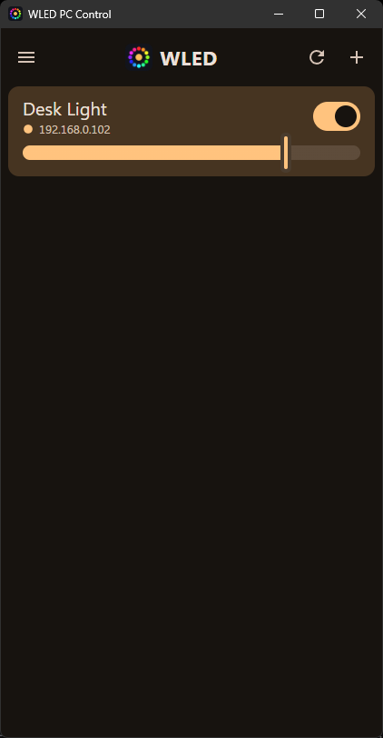
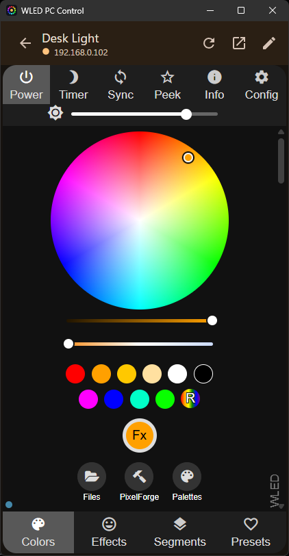
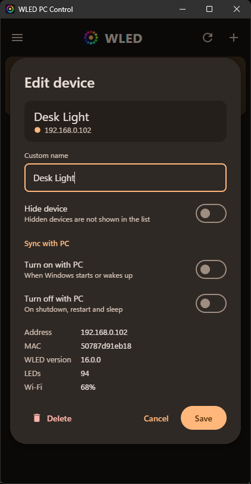
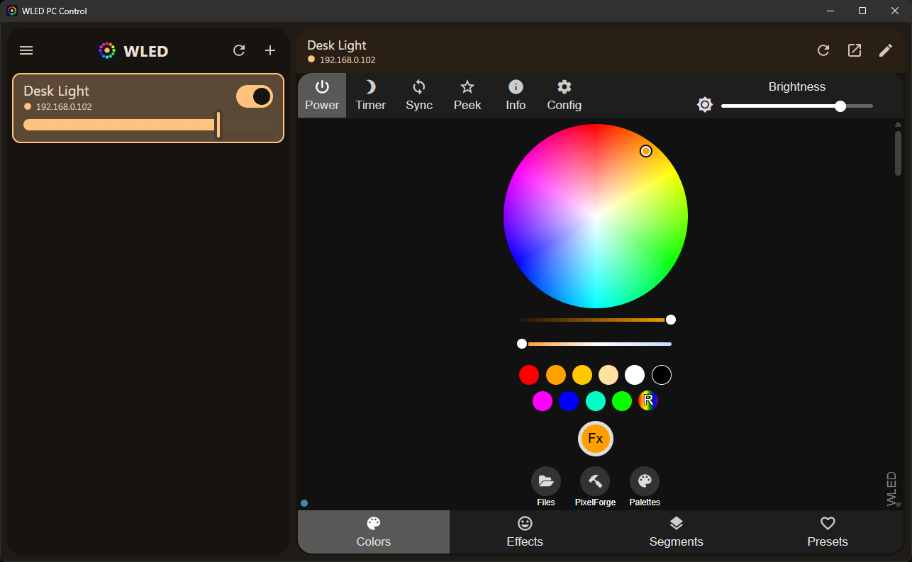

# WLED PC Control

A small Windows desktop app for all the [WLED](https://kno.wled.ge/) controllers on your local network.
It is modelled on [WLED Native for Android](https://github.com/Moustachauve/WLED-Android): a list of your lights with
quick power and brightness controls, and each device's own WLED web UI one click away.

Built with Tauri 2, React and TypeScript.

<p align="center">
  
  
  
</p>

<p align="center">
  
</p>

## Features

- **Device list.** Each card shows the device name, address and connection status. It also has a power switch and a
  brightness slider. The card is tinted with the light's current colour.
- **The device's own UI.** Click a card to open the WLED web interface served by that controller, right inside the app.
  You can also open it in your browser.
- **Live state.** Every device keeps a WebSocket connection (`ws://<ip>/ws`). Changes made from your phone or the web UI
  show up immediately.
- **Discovery.** Devices are found through mDNS (`_wled._tcp`) on startup. A full /24 subnet scan is available from the
  menu. You can also add a device by IP address or hostname (`192.168.1.50`, `wled-kitchen.local`, `host:port`).
- **Sync with PC, per device.** Each light can be set to:
  - **Turn on with PC**: when Windows starts or wakes from sleep/hibernation. The app retries for up to 90 s while the
    network comes up.
  - **Turn off with PC**: on shutdown, restart, sign-out, sleep and hibernation.
- **Tray app.** If any device uses PC sync, the app starts with Windows straight into the system tray. Left-click the tray
  icon to open the window. Right-click it for **Open / Quit**. Closing the window hides it to the tray.
- **Organise.** Set custom names and hide devices you don't need to see. Offline devices are grouped at the bottom of the
  list. A device that changes its IP is matched again by MAC address on the next discovery.
- **Adaptive layout.** In a narrow window (the default) you get a phone-style single pane. Make the window wider than
  820 px for a list + detail view.
- **Light, dark or system theme.**

## Usage

| Action | How |
| --- | --- |
| Open a device's UI | Click its card |
| Power / brightness | Switch and slider on the card |
| Rename, hide, PC sync, delete | Pencil icon on hover, or right-click the card → **Edit** |
| Add a device / scan the network | **+** in the top bar, or the ☰ menu |
| Settings (theme, list options) | ☰ menu → **Settings** |
| Quit completely | Tray icon → right-click → **Quit** |

> On first launch Windows may ask whether the app may use the network. Allow access on **private networks**. Otherwise
> mDNS discovery won't see your devices, although the subnet scan and manual adding will still work.

### Notes on PC sync

- The app has to be running, either in the window or in the tray, to catch shutdown and sleep. If you quit it from the
  tray, your lights won't follow the PC until it starts again.
- Windows only gives apps a couple of seconds before sleeping. The "off" command is sent to all devices in parallel with
  short timeouts, so a device that is unreachable at that moment simply stays on.
- Autostart registers the executable that is currently running. Enable PC sync from the **installed** app, not from
  `npm run tauri dev`.

## Building

Requirements: Node.js 18+, Rust (stable), and the
[Tauri prerequisites for Windows](https://v2.tauri.app/start/prerequisites/) (WebView2 and MSVC Build Tools).

```bash
npm install
npm run tauri dev      # development mode with hot reload
npm run tauri build    # installers in src-tauri/target/release/bundle
```

Only one instance runs at a time. If the installed app is sitting in the tray, quit it before running `tauri dev`.
Otherwise the dev build just brings the installed window to the front and exits.

## Project structure

```
src/
  App.tsx                   layout (list / detail), dialogs, context menu
  useDevices.ts             saved devices (localStorage), discovery, add / edit / remove
  useDeviceSockets.ts       one WebSocket per device, live state, power & brightness
  useSettings.ts            theme and list options
  api.ts                    calls into the Rust commands
  components/
    DeviceListItem.tsx      device card, status indicator, switch, brightness slider
    Dialogs.tsx             add / edit / delete / settings dialogs and the side drawer
    Icon.tsx                Material icons
src-tauri/src/
  lib.rs                    discovery (mDNS + subnet scan), HTTP proxy, tray icon, window setup
  pc_power.rs               autostart, shutdown / sleep / wake hooks (WM_ENDSESSION, WM_POWERBROADCAST)
```

Discovery, probing and the "sync with PC" requests go through Rust, so there are no CORS or proxy issues. Live control
uses the device's WebSocket API, and the detail view embeds the device's own web UI in an iframe.

## Credits

- [WLED](https://github.com/wled/WLED) by Aircoookie and contributors
- UI inspired by [WLED Native for Android](https://github.com/Moustachauve/WLED-Android) by Moustachauve
